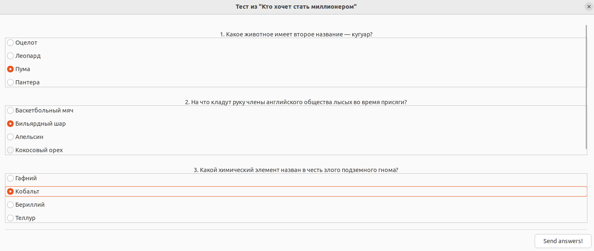

# Network Testing System 

> [!NOTE]
> Система тестирования по сети основана на обмене информацией в интернет-домене, используя протокол TCP :smile:


> [!IMPORTANT]
> * **Server** - программа, позволяющая создавать и сохранять тесты в формате *.json* и затем запускать их для получения и обработки результатов от *Client* ов.
> * **Client** - позволяет пройти тест, присланный от *Server*, отправить ответы и получить результаты. Используется интерфейс библиотеки графического интерфейса *gtkmm*.


 
 


## Содержание

[1. Пример использования сервера](#1)

Запуск сервера для создания тестов и обслуживания клиентов

[2. Пример использования клиента](#2)

Подключение к серверу для прохождения тестирования по сети

[3. Сборка ](#3)

Компиляция *Server* и *Client* 


<a name="1"></a>
 ## Пример использования сервера

#### Порт

  Взаимодействие с сервером интуитивно понятно. Ему нужно предоставить одним из трёх способов файл с тестом и номер свободного порта для подключения клиентов. Это число от 2000 до 65535:

1. Если порт **занят** операционной системой, то будет получено сообщение:
```
$ Введите номер порта:
$ 9876
$ ERROR on binding
```

  и программа завершится. В этом случае нужно попробовать указать другой номер порта.


2. Успешный **запуск**:
```
$ Введите номер порта:
$ 9876
$ Тест запущен!
```

### Способы запуска сервера

Есть два способа запустить эту программу:

#### Интерактивный запуск

```
$ ./Server
```
  ```
$ Какое действие сделать? (Напишите число)
   1 - Создать тест и запустить его
   2 - Создать тест и сохранить в файле
   3 - Запустить тест из файлa
  ```

**1 - Создать тест и запустить его**

 Будет предложено ответить на следующие вопросы для создания одного вопроса теста:
```
$ Введите название теста:
$ MyTest
$ Введите вопрос номер 1:
$ What time is it?         
$ Введите количество предлагаемых ответов:
$ 2
$ Введите вариант ответа номер 1:
$ 12 am
$ Введите вариант ответа номер 2:
$ 12 pm
$ Введите номер правильного ответа:
$ 2
$ Вопрос номер 1 добавлен.

```
  
  Далее можно добавить ещё вопросы с любым количеством вариантов ответов или завеpшить создание теста:
 
```
$ Какое действие сделать? (Напишите число)
   1 - Добавить ещё вопрос
   2 - Завершить создание теста
$ 2
$ Введите номер порта:
$ 7655
$ Тест запущен!
```
Чтобы завершить работу сервера нужно ему отправить **Ctrl + C**. 

Здесь тест не сохраняется, а запускается сразу.

**2 - Создать тест и сохранить в файле**

Здесь тест будет создан аналогично *1* и сохранён. Отличие от *1* только в последнем вопросе и результате работы:
```
$ Введите название файла для сохранения:
$ Time.json
$ Тест сохранён в файле Time.json.
```
Тест сохраняется в формате **.json**.

```
$ cat Time.json
```
```
{
    "Questions": [
        {
            "Answers": [
                "12 am",
                "12 pm"
            ],
            "CorrectAnswer": "12 pm",
            "Formulation": "What time is it?"
        }
    ],
    "TestName": "MyTest"
}
```

**3 - Запустить тест из файлa**

Здесь сразу запускается тест из файла:

```
$ Введите путь до файла с тестом:
$ Time.json
$ Введите номер порта:
$ 4333
$ Тест запущен!
```

Файл с тестом можно либо создать с помощью *2* либо написать по аналогии c *TestConfigs/*.

#### Аргументы командной строки

Можно сразу запустить уже готовый тест, подав его в качестве аргумента запуска:

```
$ ./Server  -f Time.json  -p 5656
```


-----------------------------------------------------------------------------

 
 <a name="2"></a>
 ## Пример использования клиента
 
 Все доступные опции можно узнать:
 ```
$ ./Client   --help
 ```
```
USAGE:     ./Client   [options]

OPTIONS: 
	   -h	 --help
	   -p	 --port
	   -s	 --server-hostname
```


| Опция  | Алиас |Описание         |
|:------------- |:----------|:----------------------------:|
|  **--help**       |  **-h**          | Распечатать справку.|
| **--port**        |  **-p**        | Номер порта сервера, к которому нужно подключиться. |
| **--server-hostname**        |  **-s**        | IP-адрес устройства, на котором работает сервер. Его можно узнать в Linux командой *hostname -I*. Значение по умолчанию **localhost** -- это верно, если сервер запущен на том же устройстве, что и клиент.|

Чтобы подключиться к серверу, запущенному командой:
```
$ ./Server  -f Time.json  -p 5656
```

нужно на том же компьютере:

```
$ ./Client  -s localhost  -p 5656
```

Вылезет графическое окно и после отправки ответов результат:

 

```
Please choose answers on test in window :D

Your answers: 2 
Right answers: 2
```

-----------------------------------------------------------------------------

 
 <a name="3"></a>
 ## Сборка 

> [!IMPORTANT]
> Для графического окна нужен интерфейс **gtkmm-3.0**.

На Linux его можно установить так:
```
$ sudo apt-get install libgtkmm-3.0-dev
```


Для сборки, находясь в корневой директории проекта:
 
```
$ cmake   -B build
$ cd build/
$ make
```

Программа *Client* будет в *build/Client*.

Программа *Server* будет в *build/Server*.


